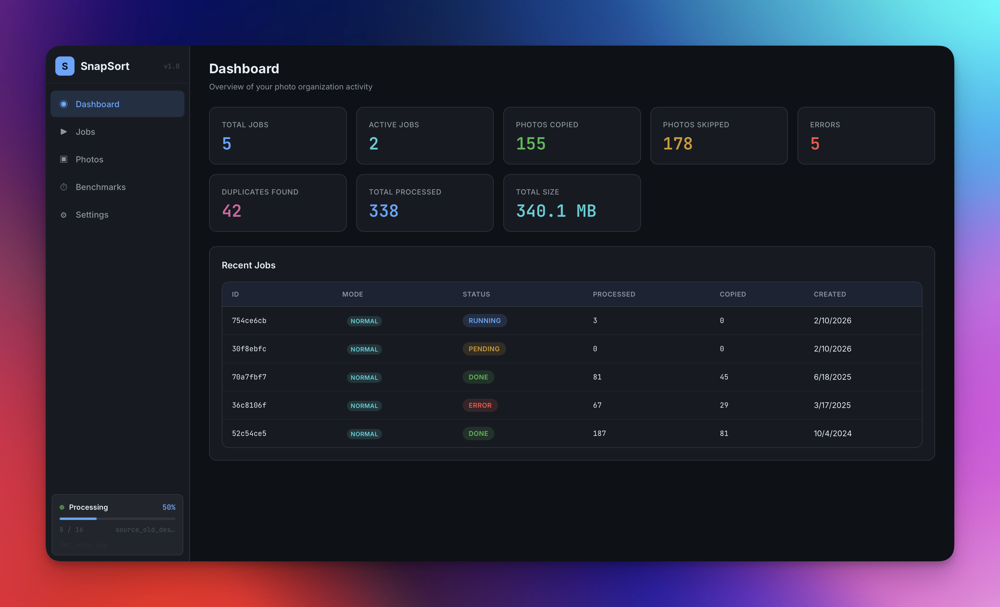
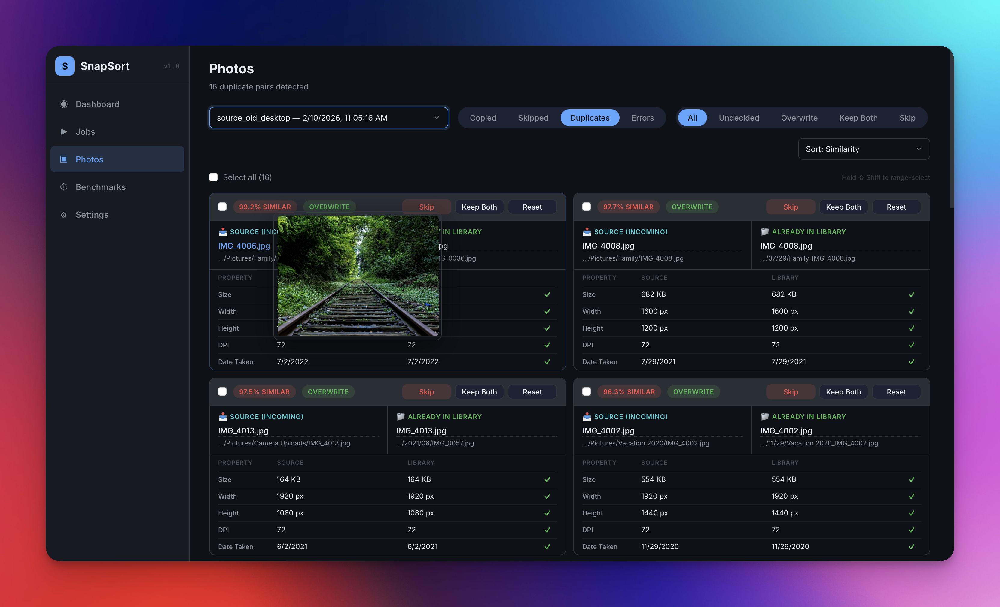
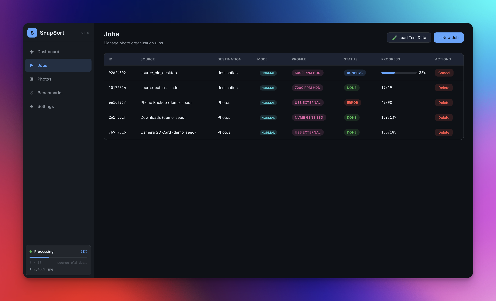
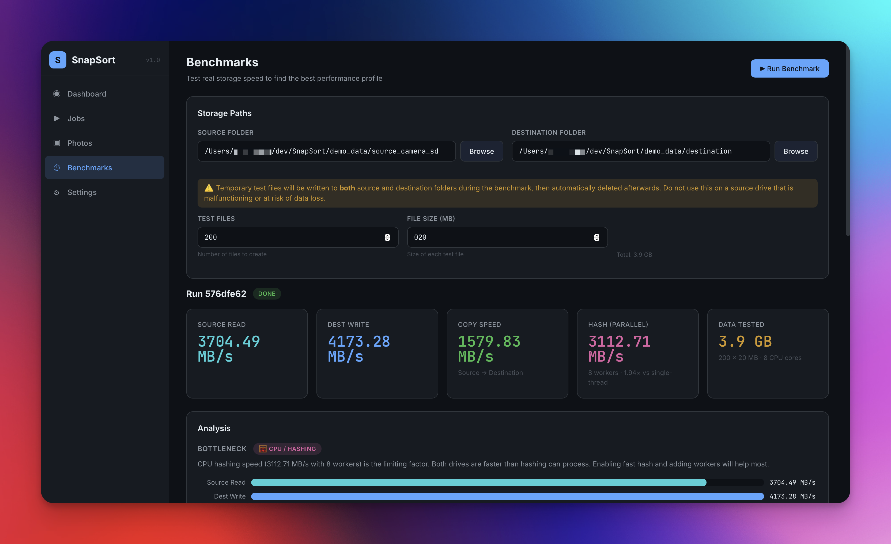

<p align="center">
  
</p>

<h3 align="center">Uncover Forgotten Moments</h3>

SnapSort helps you organize and extract personal photos from large, mixed-content drives with intelligent filtering and robust processing. It automatically sorts images by date while avoiding system files and application images, making it perfect for recovering memories from old hard drives or organizing large photo collections.

SnapSort is available as both a **Python CLI tool** and a **full-stack web GUI** — run it locally, in Docker, or on Unraid.


<p align="center">
  
</p>

---

## ✨ Key Features

### 📅 Date-based Photo Organization
SnapSort automatically organizes your images into a clean folder structure based on when they were taken. It reads EXIF data from your photos to determine the actual capture date, falling back to file modification dates when EXIF data isn't available. Your photos are sorted into year/month/day folders, making it easy to find specific memories.

### 🧠 Intelligent Filtering System
The filtering system ensures you only get actual photos, not system icons, application images or thumbnails. It automatically skips system folders and filters out small images that are likely thumbnails or icons. SnapSort defaults to filtering out images less than 600×600 pixels or 50 KB, but allows you to flexibly choose these values. If enabled, SnapSort will save a CSV file that allows you to manually review its decision on a file-by-file basis, letting you force-process images that were misclassified.

**Supported image formats:**
SnapSort supports common photo and RAW formats out of the box. You can add additional extensions, but note that dimension-based filtering and enhanced deduplication (resolution, EXIF date matching) require Pillow support for the format. Formats that Pillow cannot open will still be processed using hash-based and metadata-based (file size, filename, mtime) duplicate comparison. Default formats:
- `.jpg`, `.jpeg`, `.png`, `.cr2`, `.nef`, `.arw`, `.tif`, `.tiff`, `.rw2`, `.orf`, `.dng`, `.heic`, `.heif`

For EXIF extraction, it uses `piexif`/Pillow for JPEG/TIFF files and falls back to `exiftool` for other formats.

### 🔍 Deduplication Engine
SnapSort includes a multi-strategy deduplication system:
- **Hash-based**: SHA256 (full or fast partial-hash sampling begin+middle+end) to detect exact duplicates — a single implementation shared across seeding, dedup scoring, and file-exists checks
- **Metadata-based**: Compares dimensions, date taken, and file size for near-duplicate detection
- **Configurable thresholds**: Strict threshold (auto-skip) and log threshold (flag for review)
- **Destination seeding**: Pre-indexes existing files in the destination to avoid re-copying
- **Actionable resolutions** *(Web GUI)*: Duplicate pairs can be resolved directly from the UI — **Skip** leaves the destination as-is, **Overwrite** copies the source over the matched destination file, **Keep Both** copies the source alongside the match with a unique filename. All operations write to the destination only; source files are never modified

<p align="center">
  
</p>

### 🔔 Notifications
Stay informed about your jobs and drives with push notifications:
- **ntfy.sh**: Send notifications to your phone or desktop via any ntfy-compatible app — supports default `ntfy.sh` or self-hosted servers, with optional token or basic authentication
- **Browser notifications**: Native browser push notifications via the Notification API, powered by SSE from the backend
- **Configurable events**: Choose which events trigger notifications — job start, completion, errors, progress updates (on a configurable interval), drive attach, and drive lost
- **Drive monitoring**: Automatic polling detects when drives are attached, safely ejected, or unexpectedly lost, and fires corresponding notifications

### ⏳ Progress Tracking
Real-time feedback during operation:
- **CLI**: Animated spinner during initialization (destination indexing and source scanning), inline progress with files processed, copied, skipped, errors, and ETA, plus a comprehensive log file recording every action
- **Web GUI**: Live progress bars per job, real-time file counter updates (polled every 500 ms), and an always-visible sidebar indicator showing the currently processing file

### 🌐 Web GUI
A full-stack web interface for managing photo organization visually:

- **Dashboard** — overview stats across all jobs with configurable date formatting
- **Jobs** — create, start, monitor, and delete organization runs with live progress bars; name your jobs for easy identification; choose a performance profile per job with a settings summary preview

<p align="center">
  
</p>
- **Photos** — browse all processed photos with status filtering (copied/skipped/error/duplicate), regex search, skip reasons, dimensions, date taken, hover image previews, a **photo detail modal** with full EXIF metadata viewer, and an integrated **Duplicates** tab for reviewing flagged duplicate pairs with side-by-side comparison, metadata diffs, and per-duplicate resolution actions
- **Benchmarks** — test real storage I/O on your source & destination folders, identify the bottleneck, and get a recommended performance profile (see below)
- **Settings** — tabbed layout (General, Filters & Formats, Performance, Notifications) with inline performance profile editing, creation, and deletion; ntfy.sh and browser notification configuration; configurable date/time display formats and theme selection
- **Diagnostics** — system info, Python/Node.js versions, mounted drives, CPU & memory usage with sparkline charts, and a live SSE log stream with regex filtering (togglable from Settings)
- **File Picker** — server-side directory browser with external drive detection
- **Test Data** — one-click test dataset loading for development and validation
- **Theming** — full dark and light theme support with system-preference detection; switch themes from Settings
- **Responsive** — fully responsive layout with a mobile top-down drawer navigation; all pages adapt from desktop to phone

### 📊 Storage Benchmarks & Profile Suggestions
SnapSort can benchmark the actual drives you'll use and recommend the best performance profile:

1. **Select your source and destination folders** using the file picker (with drive detection)
2. **Automated testing** measures sequential read, sequential write, and copy throughput on both volumes, plus single-thread and multi-thread hash speed using `ThreadPoolExecutor`
3. **Bottleneck analysis** identifies whether the source volume, destination volume, or CPU hashing is the limiting factor — shown with a visual bar chart
4. **Profile recommendation** suggests the best built-in profile based on the *slowest storage* in the chain — because the bottleneck sets the pace
5. **One-click apply** writes the recommended profile's settings as your global defaults

<p align="center">
  
</p>

Same source/destination path is blocked at both the frontend and backend.

### ⚡ Performance Profiles
SnapSort ships with 7 built-in performance profiles tuned for different storage types:

| Profile | Workers | Batch | Hash KB | Copies | Threading | I/O Mode |
|---------|---------|-------|---------|--------|-----------|----------|
| NVMe Gen4 SSD | 16 | 100 | 16384 | 8 | Multi | Parallel |
| NVMe Gen3 SSD | 12 | 75 | 8192 | 6 | Multi | Parallel |
| SATA SSD | 8 | 50 | 4096 | 4 | Multi | Parallel |
| 7200 RPM HDD | 1 | 10 | 4096 | 1 | Single | Sequential |
| 5400 RPM HDD | 1 | 5 | 2048 | 1 | Single | Sequential |
| USB External | 2 | 15 | 2048 | 1 | Single | Sequential |
| Default | 4 | 25 | 4096 | 2 | Multi | Parallel |

Profiles can be applied globally from Settings, per-job during job creation, or automatically from benchmark results. Custom profiles can be created, edited, and deleted directly from the Settings page.

> **Note:** Performance profiles, storage benchmarks, and drive detection are Web GUI features. The CLI uses direct configuration constants. Adding `--profile` and `--benchmark` CLI flags is on the roadmap.

### �️ Source Safety Guarantee
SnapSort will **never** write to, modify, rename, move, or delete any file or directory in your source locations. Source drives and directories are treated as **strictly read-only** at every layer of the application:

- **Python engine**: Every copy operation verifies the destination is not inside the source directory before writing. A `RuntimeError` is raised if violated.
- **Node.js backend**: A dedicated `sourceGuard` module checks every destructive file operation against all known source directories. Job creation is rejected if the source and destination directories overlap in any direction.
- **API layer**: No endpoint exists that can modify or delete source files. The only file operations SnapSort performs on disk are writing to the destination directory and cleaning up its own output. Duplicate resolutions (Overwrite, Keep Both) are guarded by `assertNotInSource()` before any write.
- **Overlap protection**: Job creation is rejected if source and destination paths overlap in any direction (same directory, destination inside source, or source inside destination). Enforced at the Python engine, Node.js backend, and React frontend.

This is SnapSort's **#1 invariant** — enforced by defense-in-depth across the full stack.

### �🐳 Docker & Unraid Support
SnapSort ships as a unified single container:

- **Multi-stage Dockerfile**: Frontend build → backend dependencies → runtime with Node.js + Python
- **Single service** on port 8080 (configurable)
- **docker-compose.yml** for easy deployment
- **Unraid XML template** for native Docker tab integration with configurable ports, photo share path, and appdata path

---

## 🏗️ Architecture

```
SnapSort/
├── photo_organizer.py        # Python engine (CLI + JSON mode)
├── photo_utils.py             # Image processing, EXIF, copy logic
├── dedup_utils.py             # Deduplication index & matching
├── path_utils.py              # Destination path construction
├── logging_utils.py           # CSV/log utilities (CLI)
├── VERSION                    # Single source of truth for version (read by Python, Node.js, and frontend)
├── backend/                   # Node.js Express API
│   └── src/
│       ├── index.js           # Express server (serves API + SPA, SSE log stream)
│       ├── sourceGuard.js     # Read-only enforcement for source paths
│       ├── db/                # SQLite schema + DAO (incl. performance_profiles table)
│       ├── routes/            # REST endpoints (jobs, photos, duplicates, benchmarks, profiles, settings, etc.)
│       └── services/          # Python bridge, ntfy.sh service, browser notify service, CPU monitor, drive monitor, log buffer
├── frontend/                  # React 18 + Vite SPA
│   └── src/
│       ├── pages/             # Dashboard, Jobs, Photos (incl. Duplicates tab), Benchmarks, Settings, Diagnostics
│       ├── components/        # Modal, DataTable, FilePicker, Badge, StatCard, SparklineCard, PhotoDetailModal, Sidebar, etc.
│       ├── hooks/             # useNotifications (browser push via SSE)
│       ├── SettingsContext.jsx # Global theme, date/time format provider
│       ├── dateFormat.js      # Shared date/time formatting utilities
│       └── index.css          # Custom CSS with dark & light themes
├── scripts/                   # Dev utilities (DB seeding, cleanup)
├── Dockerfile                 # Unified multi-stage build
├── docker-compose.yml         # Single-service deployment
├── unraid/                    # Unraid Docker template
├── generate_test_data.py      # Test dataset generator
└── package.json               # Root dev script (concurrently)
```

**Tech Stack:**
- **Backend**: Node.js, Express 4, better-sqlite3 (WAL mode), uuid, cors, exifr
- **Frontend**: React 18, Vite 6, React Router 6, Lucide React icons, custom CSS with dark & light themes
- **Engine**: Python 3.9+, Pillow, piexif
- **Deployment**: Docker (Alpine-based), Unraid XML template

---

## 🔧 Workflow Management

### 📝 CSV Logging and Configuration *(CLI only)*
The CLI generates detailed CSV logs that serve multiple purposes beyond simple record-keeping. These files contain complete configuration information embedded within them, making each log self-contained and portable. Config and filtering heuristics are saved in the CSV as a single cell in the second row, making it robust and spreadsheet-friendly.

When running in manual or resume mode, the script automatically reads all config values from the CSV and applies them, ensuring consistency across sessions.

> The Web GUI does not use CSV logging — all photo metadata, skip reasons, and duplicate information are stored in the SQLite database and accessible through the Photos page.

### 📂 Log Files *(CLI only)*
The CLI writes a detailed `photo_organizer.log` file recording every action with timestamps. The log file name can be customised at startup. In JSON mode (used by the Web GUI), file logging is suppressed — all events are streamed via the JSON protocol to the Node.js backend instead.

### 🔄 Operation Modes
SnapSort offers three distinct operation modes:

- **Normal Copy:** Scans and processes all files according to current heuristics
- **Manual Copy** *(CLI only)*: Only copies files explicitly marked in the CSV (`copy_anyway == yes`), with destination paths reconstructed automatically
- **Resume Copy** *(CLI only)*: Continues a previous operation by skipping files already listed in the CSV, reading and applying all config and heuristics from the existing file

> The Web GUI currently operates in Normal mode only. The equivalent of Manual Copy is available via the "Copy Anyway" override feature on the Photos page, where you can select skipped photos and force-copy them. Resume and Manual CSV-based modes are CLI-specific workflows.

### 🔍 Duplicate Handling: CLI vs Web GUI

| Capability | CLI | Web GUI |
|---|---|---|
| Auto-skip strict duplicates | ✅ | ✅ |
| Log potential duplicates | ✅ (log file + CSV) | ✅ (database) |
| Interactive duplicate resolution | — | ✅ (Skip / Overwrite / Keep Both per pair) |
| Resolutions apply to files | — | ✅ (copies to destination, never modifies source) |
| Bulk duplicate resolution | — | ✅ |
| Override skipped files | ✅ (CSV `copy_anyway` column) | ✅ (Photos page override action) |
| Per-photo file hash stored | — | ✅ (SHA-256 partial or full, stored in DB) |

---

## 🚀 Getting Started

### One-Line Install

Run this single command to install and start SnapSort — it handles everything automatically:

```bash
/bin/bash -c "$(curl -fsSL https://raw.githubusercontent.com/Rediwed/SnapSort/main/scripts/install.sh)"
```

The installer will automatically:
- Install **Git**, **Docker**, and **Docker Compose** if they're not already present (macOS & Linux)
- Clone SnapSort to `~/SnapSort` (or pull updates if it already exists)
- Ask for your photo folder path and preferred port
- Build and start the container

No prerequisites required — just a terminal and an internet connection.

---

### Option 1: Docker (Recommended)

Docker packages everything SnapSort needs into a single container — no manual dependency management required.

#### Prerequisites

1. **Install Docker Desktop** (includes Docker Compose):
   - **macOS / Windows**: Download from [docker.com/products/docker-desktop](https://www.docker.com/products/docker-desktop/)
   - **Linux**: Follow the [official install guide](https://docs.docker.com/engine/install/), then install [Docker Compose](https://docs.docker.com/compose/install/)

2. **Clone the repository**:
   ```bash
   git clone https://github.com/Rediwed/SnapSort.git
   cd SnapSort
   ```

#### Configure your photo paths

Before starting, edit `docker-compose.yml` to mount the drives/folders you want SnapSort to access. The default looks like this:

```yaml
volumes:
  - db-data:/app/backend/data         # persist SQLite database
  - /mnt/user/photos:/mnt/photos      # ← change this to your photo folder
```

Replace `/mnt/user/photos` with the actual path on your system, e.g.:
- **macOS**: `/Users/you/Pictures:/mnt/photos`
- **Windows (WSL)**: `/mnt/c/Users/you/Pictures:/mnt/photos`
- **Linux**: `/home/you/Pictures:/mnt/photos`

You can add multiple volume mounts if you have photos on different drives:
```yaml
volumes:
  - db-data:/app/backend/data
  - /Volumes/ExternalHDD:/mnt/external:ro    # read-only source
  - /Users/you/Pictures:/mnt/photos           # destination
```

#### Start SnapSort

```bash
docker compose up -d
```

This builds the container on first run (takes a few minutes) and starts it in the background. Open [http://localhost:8080](http://localhost:8080) in your browser.

| Command | What it does |
|---------|-------------|
| `docker compose up -d` | Start SnapSort in the background |
| `docker compose logs -f` | Follow live logs |
| `docker compose down` | Stop SnapSort |
| `docker compose up -d --build` | Rebuild after pulling updates |

---

### Option 2: Local Development

Run the backend and frontend directly on your machine — useful if you want to contribute or customize.

#### Prerequisites

| Dependency | Version | Install |
|-----------|---------|---------|
| **Node.js** | 18+ | [nodejs.org](https://nodejs.org/) or `brew install node` |
| **npm** | (bundled with Node.js) | — |
| **Python** | 3.9+ | [python.org](https://www.python.org/) or `brew install python` |
| **pip** | (bundled with Python) | — |
| **exiftool** | latest (optional) | [exiftool.org](https://exiftool.org/) or `brew install exiftool` |

#### Install & run

```bash
# Clone the repo
git clone https://github.com/Rediwed/SnapSort.git
cd SnapSort

# Install all dependencies (root + backend + frontend)
npm install && npm install --prefix backend && npm install --prefix frontend
pip install -r requirements.txt

# Start both backend and frontend in dev mode
npm run dev
```

Open [http://localhost:5173](http://localhost:5173) — the backend runs on port 4000, and the frontend dev server on 5173 with an API proxy.

---

### Option 3: CLI Only

If you just want the Python photo organizer without the web GUI:

```bash
# Clone and install Python dependencies
git clone https://github.com/Rediwed/SnapSort.git
cd SnapSort
pip install -r requirements.txt

# Run the organizer
python3 photo_organizer.py
```

Choose your operation mode, set source/destination directories, and SnapSort will organize your photos from the terminal.

---

### Option 4: Unraid

SnapSort includes a native Unraid Docker template:

1. Copy `unraid/snapsort.xml` to `/boot/config/plugins/dockerMan/templates-user/`
2. Go to **Docker → Add Container** → select the **SnapSort** template
3. Configure your photo share path (e.g. `/mnt/user/photos`) and port (default: 8080)
4. Click **Apply** — Unraid will pull/build the container and start it

---

### 🧪 Test Data

Generate realistic test datasets to validate SnapSort's behavior without using your real photos:

```bash
python3 generate_test_data.py
```

This creates 5 source datasets simulating real-world scenarios (camera SD card, downloads folder, phone backup, old desktop, external HDD) plus edge cases (corrupt files, zero-byte, wrong extensions, borderline dimensions). Then use the **🧪 Load Test Data** button in the web GUI to run them all.

---

## 🎛️ Customization

- **Filtering heuristics**: Adjust minimum size, resolution, or system folders via the GUI Settings page or by editing constants in `photo_organizer.py`
- **Supported formats**: Add or remove extensions via the GUI Settings page or in the `SUPPORTED_EXTENSIONS` tuple in `photo_organizer.py`
- **Deduplication**: Configure strict/log thresholds and partial hash size
- **Job management**: The GUI supports creating multiple jobs with different source/destination pairs, each with independent filter settings
- **System/application folder filtering**: A unified set of auto-skipped system folders (e.g. `windows`, `appdata`, `cache`, `$recycle.bin`, `system volume information`, `temp`) is used for both directory-tree pruning during scanning and per-file path filtering during copying. The set is defined in `photo_organizer.py` and is currently non-configurable. A configurable filtering system for both CLI and GUI is on the roadmap

---

## 🔀 Parallel Processing

You can run multiple instances of SnapSort simultaneously to process different folders or drives in parallel. The web GUI supports running multiple jobs concurrently with independent progress tracking.

**Tips:**
- Use different destination folders for each concurrent source to avoid duplicate naming conflicts
- The GUI's job system handles concurrent runs with separate progress bars and status tracking
- Directory creation and file copying are safe for concurrent use

---

## 🔮 Future Development

- **Manual & Resume modes in Web GUI:** Bring CSV-based Manual Copy and Resume Copy workflows to the web interface
- **CLI `--profile` flag:** Apply named performance profiles from the command line
- **CLI `--benchmark` flag:** Run storage I/O benchmarks directly from the terminal
- **Post-run duplicate review in CLI:** Interactive review of flagged duplicates after processing
- **Configurable system folder filtering:** Editable blocklist for system/application folders in both CLI and GUI
- **Improved folder-name awareness:** Retain event/memory grouping when photos span nested folders
- **Project management:** Support multi-drive projects with cross-drive analysis, manual evaluation, and unified reporting
- **Auto-start on drive connection:** Automatically trigger jobs when a configured drive is attached
- **Analyze-only mode:** Build CSV without copying files for manual review
- **Customizable storage template:** User-defined destination folder structure using template variables (inspired by [Immich](https://immich.app/)), e.g. `{{y}}/{{y}}-{{MM}}/{{filename}}.{{ext}}`. Support variables for date/time (`{{y}}`, `{{MM}}`, `{{dd}}`), camera metadata (`{{make}}`, `{{model}}`), and file info (`{{filename}}`, `{{ext}}`, `{{filetype}}`)\n- **Dedicated Duplicates page:** Evaluate whether duplicate management warrants its own top-level page given its critical nature

---

## �️ Technical Backlog

| ID | Description | Priority |
|----|-------------|----------|
| TB-001 | **Migrate backend from CommonJS to ES Modules** — `backend/src/index.js` and all route files currently use `require()`/`module.exports`. Should be migrated to `import`/`export` to match the ESM convention used across all other projects in this workspace. Requires updating `backend/package.json` to add `"type": "module"` and converting all `require()` calls. | Low |

---

## �📄 License and Support

This project is licensed under the Creative Commons Attribution-NonCommercial 4.0 International (CC BY-NC 4.0) License. You're free to use and adapt the project for non-commercial purposes with proper attribution to @Rediwed. See the LICENSE file for complete details.


